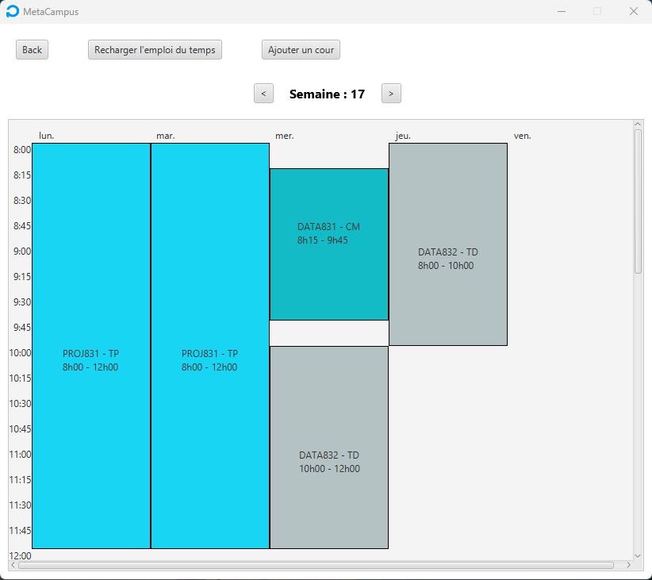

# Projet PROJ831 : Meta-Campus - Application dashboard étudiant

Projet finale de l'année scolaire qui consiste à réaliser une application destinée à aider les étudiants dans leur apprentissage, en leur fournissant des informations diverses, telles que l’avancement temporel des enseignements, les travaux à rendre, le niveau de charge de la semaine, toutes les informations concernant les modules...

---
## Table des matières
- [Fonctionnalités](#fonctionnalités)
- [Conception](#conception)
- [Utilisation](#utilisation)

---
## Conception
La première étape du projet a été la conception préliminaire de l'application. Cela se traduit par un moment de réflexion sur l'application que nous voulons réaliser, avant de réaliser les diagrammes d'utilisation, d'état, Entité-Association,  de séquences et de classes ainsi que la maquette.

### Modèle E/A

Voici le modèle Entité-Association de la base de donnée liée à notre application :

Les entités fonctionnelles de notre application sont donc :
- Ecole
- Promo
- Eleve
- Travail
- Note
- Module
- Cours
- Filiere
- UE
- Enseignant

Le principe de notre application est donc le suivant :
L'école contient des promos. Une promo correspond à une filière (IDU3, MM4...) et une année, exemple : IDU3 de 2022. Une filière contient des UE qui sont composés de modules. Un module est composé de différents cours, et un module peut être suivi par plusieurs filières.
Un élève appartient à une promo qui contient plusieurs élèves. Chaque élève possède plusieurs notes qui sont associées à un travail. Un travail s'inscrit dans un module et est préparé par un enseignant. Un enseignant enseigne un ou plusieurs modules.

Nous avons implémenté notre base de données avec phpMyAdmin en SQL. 

### Diagramme de classes

Nous avons réfléchit à un diagramme de classe à partir de ces entités qui servira de base à l'implémentation du code, les cardinalités sont notés suivant la norme UML (les classes utils ne sont pas affichées sur ce diagramme) :

A noter que `Fillière` est une énumération au sens Java, donc un type spécial de classe qui peut posséder des attributs comme une classe normale.

Pour cette application, nous avons implémenté les patterns suivant :

- `Singleton` au travers de la classe Ecole, afin qu'il n'y ait qu'une seule instance d'école contenant la liste de toutes les promos présente dans l'application.
- `Factory` au travers de la classe CoursFactory, qui permet de créer des TP, TD ou CM : différents types de cours avec des durées différentes et potentiellement d'autres attributs.

### Cas d'utilisation

Les diagrammes de cas d'utilisation nous permettront de définir le comportement de l'application en fonction des requêtes de l'utilisateur :

### Diagrammes de séquences

Voici les diagrammes de séquence qui vont nous permettre de tracer le chemin des appels de fonction pour chaque cas d'utilisation :

##### Connexion d'un utilisateur

L'utilisateur va demander à l'application de le connecter à l'aide d'un login et d'un mot de passe. Cette dernière va le connecter ou non selon la validité de ses identifiants.

##### Consulter les cours de la semaine

Pour obtenir ses cours de la semaine, l'élève utilisateur va d'abord se connecter puis obtenir depuis son objet Eleve les jours de la semaine. Pour chaque jour de la semaine, on récupère tous les modules suivis par l'élève. Pour chaque module, on récupère les cours de ce module. Pour chaque cours, on récupère la date du cours. Si le cours a lieu ce jour là, on l'ajoute à la liste des cours de la semaine. Après avoir loopé pour chaque jour, on retourne la liste des cours de la semaine.

##### Consulter les travaux à faire

Après connexion, l'utilisateur récupère l'ensemble de ses travaux avec son objet Eleve, puis pour chaque travaux on récupère sa date et on vérifie si le travail n'est pas passé. Si c'est le cas on l'ajoute à la liste des travaux de la semaine. A la fin, on retourne cette liste.

##### Consulter les notes

Les notes sont stockées dans l'attribut informations de l'objet Eleve, donc il suffit de retourner cet attribut.

### Diagramme d'états - transitions

Voici le diagramme d'état de notre application, ce dernier nous aide à conceptualiser l'évolution des états de l'applications et donc des différents écrans à présenter à l'utilisateur :

---
## Fonctionnalités
Lors du lancement de l'application, vous devez vous connecter :

Vous arrivez ensuite sur une page d'accueil :

Nous pouvons voir sur cette fenêtre :
 - le nom de l'élève et de la promo
 - la charge de travail de la semaine
 - les dernières notes
 - les travaux à rendre et leurs date

A partir de cette page, nous pouvons accéder à l'emploi du temps généré à partir de la base de donnée en cliquant sur `Planning` : 

Nous pouvons aussi accéder à l'ensemble des notes de tous les modules, ainsi que les moyennes en cliquant sur `Mes modules` :

Enfin, nous pouvons accéder à notre compte en cliquant sur le nom de l'utilisateur : 

Depuis cette page, on peut voir l'avancement du module en fonction du nombre de cours passés, les travaux à rendre pour chaque module, les notes et les moyennes de chaque module.

---
## Utilisation

Prérequis: 

- Avoir une base de données mysql et importer le fichier .sql fourni.

- Avoir Java Runtime Environment à jour (version 17 ou plus).

Lancement:

- Modifier les informations du fichier config.yml avec les informations de sa propre base de données.

- Ouvrir le dossier Application puis lancer Application.bat.

- Se connecter avec le login d'un des élèves de la BDD. Le mot de passe est crypté, pour tous les élèves le mot de passe est "test".

exemple: 

         login --> gonaya
         mdp --> test

---
### Crédits
Projet conçu et élaboré par GONAY Arthur, GUERIOT Benjamin, NICOLAS Thomas, PACCOUD William, PRUVOST Jordan et TAKAHASHI Vincent
